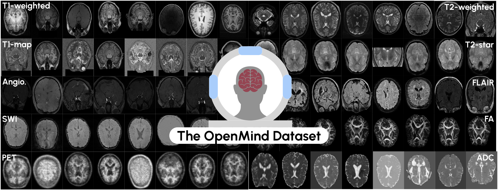

## An OpenMind for 3D medical vision self-supervised learning
<sub>Copyright German Cancer Research Center (DKFZ) and contributors. Please make sure that your usage of this code is in compliance with its license.<sub>

This is the main repository associated for the paper `An OpenMind for 3D medical vision self-supervised learning`, intended for the Review.
It holds the code for the self-supervised pre-trainings conducted in the Benchmark study.

Currently it includes the **ResEnc-L** [[a]((https://arxiv.org/abs/2410.23132)),[b](https://arxiv.org/abs/2404.09556)] CNN architecture and the [Primus-M](https://arxiv.org/abs/2503.01835) Transformer architecture, as well as the following pre-training methods for both architectures, where applicable
1. [Volume Contrastive (VoCo)](https://arxiv.org/abs/2402.17300)
2. [VolumeFusion (VF)](https://arxiv.org/abs/2306.16925)
3. [Models Genesis (MG)](https://www.sciencedirect.com/science/article/pii/S1361841520302048)
4. [Default MAE (MAE)](https://openaccess.thecvf.com/content/CVPR2022/html/He_Masked_Autoencoders_Are_Scalable_Vision_Learners_CVPR_2022_paper)
5. [Spark 3D (S3D)](https://arxiv.org/abs/2410.23132)
6. [SimMIM (SimMIM)](https://openaccess.thecvf.com/content/CVPR2022/html/Xie_SimMIM_A_Simple_Framework_for_Masked_Image_Modeling_CVPR_2022_paper.html)
7. [SwinUNETR pre-training  (SwinUNETR)](https://arxiv.org/abs/2111.14791)
8. [SimCLR (SimCLR)](https://arxiv.org/abs/2002.05709)

-----
### Complimentary resources:

**[OpenMind Dataset](https://huggingface.co/datasets/AnonRes/OpenMind)**

**[Segmentation Fine-tuning Framework](https://github.com/TaWald/nnUNet)**

**[Classification Fine-tuning Framework](https://github.com/constantinulrich/SSL3D_classification)** Simple framework that allows 3D image classification. 

**[OpenMind pre-trained Checkpoints](https://huggingface.co/collections/MIC-DKFZ/openmind-models-6819c21c7fe6f0aaaab7dadf)**
*You don't need to manually download the checkpoints (for segmentation). The framework will automatically download the checkpoints for you*

----

Below you will find a brief description of the needed steps, to get started with nnssl. 
Check-out the [documentation](documentation/) directory for a lot more information on how to use this repository.

## Installation

1. Download/clone the repository
2. Unzip and navigate into the repository
3. Install the repository `pip install -e .`  (-e optional)

[More details here](documentation/installation_instructions.md).
<details>
<summary>4. Setting environment variables:</summary>

In addition to the installation, this repository requires setting up three additional path 
1. `nnssl_raw` -- The path holding datasets of raw `pretrain_data.json` files.
2. `nnssl_preprocessed` -- A path where preprocessed data will be stored.
3. `nnssl_results` -- A path where results will be stored.

[More details here](documentation/setting_up_paths.md). 
</details>

## Workflow
In order to conduct pre-training with this repository three main steps need to be conducted.

### 1. Raw Data Preparation
> This is a brief description. For a more detailed version, check [here](documentation/dataset_format.md). 

First, some pre-training dataset needs to be chosen. You can use the **[OpenMind dataset](https://huggingface.co/datasets/AnonRes/OpenMind)**. 
However any other dataset could be used as well. Opposed to nnU-Net, the data does not have to be in a specific format. Instead, a `pretrain_data.json` file needs to be created detailing the datasets specific information. (For simplicity the OpenMind dataset comes with this). To create this file for your own dataset or to understand the file, we refer to the instructions below.

> If you use the OpenMind dataset, use the dedicated call `nnssl_convert_openmind` to create it's associated `pretrain_data.json`
<details>
<summary>Understanding and creating the `pretrain_data.json` file</summary>

Medical datasets generally center around studies of subjects. These subjects can be imaged in different sessions with different scanners or through different imaging protocols. This is reflected in the common BIDS data structure, which differentiates into:

  - `subjects` - The individual subjects in the dataset
  - `sessions` - The individual sessions of the subjects
  - `scans` - The individual scans of the sessions

  In our case, we are also interested in aggregating multiple datasets, hence we include

  - `dataset` - The individual datasets that was included

  All this information may be valuable for pre-training, e.g. one may want to develop a contrastive pre-training method that uses `scans` of the same `subject` during one `session` as positive pair and others as negative. Or one may want to develop a longitudinal `pre-training` that e.g. tries to predict the next scan of the next `session`. To allow using such information, we need to maintain this information in the `pretrain_data.json` file.
  <details>
  <summary>Hence, our `pretrain_data.json` file mirrors the BIDS structure:</summary>

  ```jsonc
  {  // Examplary Structure
    "collection_index": 745,    // Collection Index -- 
    "collection_name": "Dataset745__OpenNeuro",     // Collection Index -- 
    "datasets": {     // Dict of all datasets included
      "ds000001": {
        "dataset_index": "ds000001",
        "dataset_info": null,   // dict holding meta info of the dataset
        "subjects": {    // dict of all subjects
          "sub-01": {
            "subject_id": "sub-01",
            "subject_info": {
              "age": 26,
              "sex": "female",
            },
            "sessions": {     // Dict of all session and session information
              "ses-DEFAULT": {
                  "session_id": "ses-DEFAULT",
                  "session_info": null,
                  "images": [   // list of images -- Each image is it's own dictionary
                      {
                          "name": "sub-01_T1w.nii.gz",   // Image Name
                          "modality": "T1w",  // Modality of the Image
                          "image_info": {},  // Additional meta-data of the image (e.g. Scanner, etc.)
                          "image_path": "<Path_to_image>",
                          "associated_masks": {  // Associated masks of the image (if available)
                              "anatomy_mask": "<Path_to_associated_anatomy_mask>",
                              "anonymization_mask": "<Path_to_associated_anon_mask>",
                          },
                      },
                      ... // Additional images if taken in the session.
                  ],
              }
            }
          }
        }
      }
    }
  }
  ```
  </details>

  To generate this file, we recommend writing a python script that creates a `Collection` dataclass (located in `src/nnssl/data/raw_dataset.py`) and uses the `.to_dict()` method of the collection which will yield a valid `pretrain_data.json` file.

  To allow this file to be valid for differing machines, the file-paths support relative paths. 
  Relative paths are indicated through the pre-fix `$`. Moreover, when saving absolute paths the paths are checked, if the image path beginnings can be replaced by the paths in the **Environment Variables**: `["nnssl_raw", "nnssl_preprocessed"]`, replacing them with `$nnssl_raw` or `$nnssl_preprocessed` respectively.

</details>

### 2. Preprocessing the data
Currently the framework follows the nnU-Net preprocessing pipeline. This generally includes a *fingerprinting*, *planning*, and lastly *preprocessing* of the data. 
*Fingerprinting* determines overall shape and spacing of the data. 
*Planning* determines which patch size to use and which spacing to resample to.
*Preprocessing* normalizes, crops and resamples the data and saves it compressed in the `bloscv2` format[^1]. Moreover, the `pretrain_data.json` file will be copied to the `nnssl_preprocessed` directory, with the image and mask paths adjusted accordingly.


To conduct these three steps run

`nnssl_plan_and_preprocess -d <Dataset ID>`

[^1]: Bloscv2 is a compressed format that allows partial decompression and reading of the data, allowing fast I/O while minimizing CPU usage. 

### 3. Pretraining
Given the preprocessed data we can now pre-train the models. This is done by selecting a `trainer`a `dataset` and a `plan`. 
The `trainer` determines pre-training method and architecture, the `dataset` the data to use and the `plan` the preprocessing of the data.  

An exemplary pre-training call for a 4xGPU ResEnc-L MAE pre-training would be:
`python ./nnssl/run/run_training.py ID CONFIG -tr BaseMAETrainer_BS8 -p nnsslPlans -num_gpus 4`
or 
`nnssl_train ID CONFIG -tr BaseMAETrainer_BS8 -p nnsslPlans -num_gpus 4`

Note: Due to the lack of e.g. linear-probing for segmentation, no metrics aside from the train and validation loss are tracked during pre-training.

### 4. Adaptation
After pre-training, the resulting model checkpoint (or, pre-existing checkpoints) can be adapted to a specific downstream task.
This can be done via the associated [adaptation frameworks](#complimentary-resources) linked above.


## Extending and Contributing
Due to the lack of established frameworks in the domain of 3D SSL, we are open to code contributions and extensions of the current framework.
